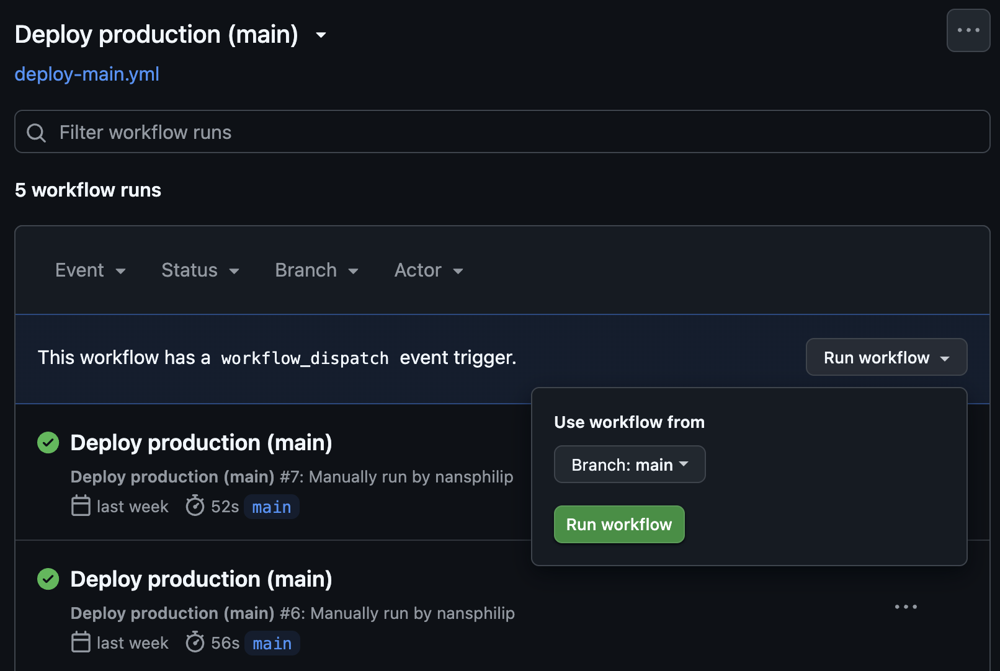

# CI/CD Workflows

[Home](../README.md) > [CI/CD Workflows](./ci-cd-workflows.md)

Development, quality checks, preview deployment, version creation and automated production deployment...

## Development process

- Development on branches like: `feature/xxx`, `fix/xxx`, etc.
- Tests on `test` branch
- Production on `main` branch

## Commit checks

When you make a `commit`, code quality checks are automatically performed.

- **Husky**: `git hooks` manager

    Executes a script in [.husky/pre-commit](../.husky/pre-commit).

- **Lint-staged**: linting/formatting on modified files only

    Provides the list of modified files in the `commit` on which to perform checks. Cancels the current `commit` if the checks do not pass.

- **Commitlint**: conventional commit format validation

    Verifies that the `commit` message follows the commit naming convention.
    The message must be prefixed with `feat`, `fix`, `chore`, etc... to be valid.

## Pull Request to `test` or `main`

When a Pull Request to `test` or `main` is created, or when a commit is pushed after, a GitHub Workflow is automatically triggered.

1. Commit message check (conventional commits)
2. Code quality checks:
    - Lint check
    - Format check
    - Type check

3. Build and test check:
    - Build check
    - Start server for tests (in background)
    - Unit tests
    - Functional tests (coming soon)
    - End-to-end tests (coming soon)

Go to your repo, click on `Actions` tab, find the `Pull request` workflow and click on it to see the workflow progress details.

Build and test check takes a bit longer to run, so you can see the progress details by clicking on it.

## Manual deployment

The manual deployment uses a **deploy key** to trigger a deployment on Coolify. It is possible to deploy the `test` branch for a `preview` or the `main` branch for a `production` environment.

### Manual preview deployment from `test`

Go to your repo, click on `Actions` tab, find the `Deploy preview` workflow, select `test` branch, then click on `Run workflow` button.

You will see the workflow progress details by clicking on it.

### Manual production deployment from `main`

Same process as for `test` branch, but select `main` branch. However, this workflow is more complex because it creates a tag, a GitHub release, a changelog, and an automatic commit.

1. Creates a tag, a GitHub release, a changelog, and an automatic commit
2. Uses a **deploy key** to trigger a `production` deployment from `main` branch on prod URL: [eco-service.nansp.dev](https://eco-service.nansp.dev)

You will see the workflow progress details by clicking on it.

