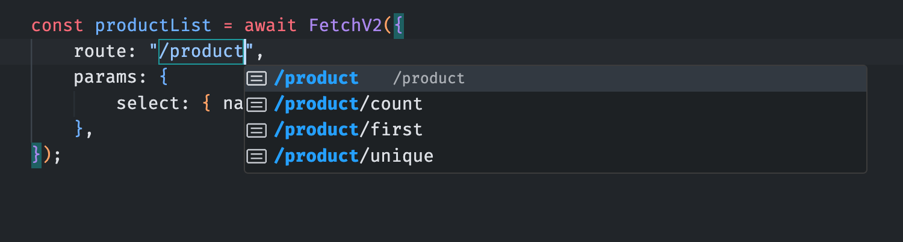
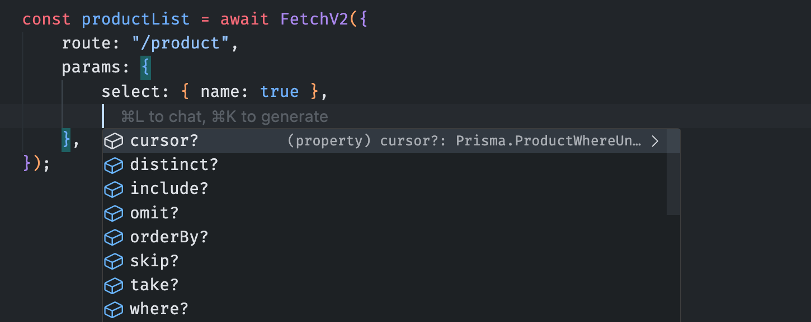
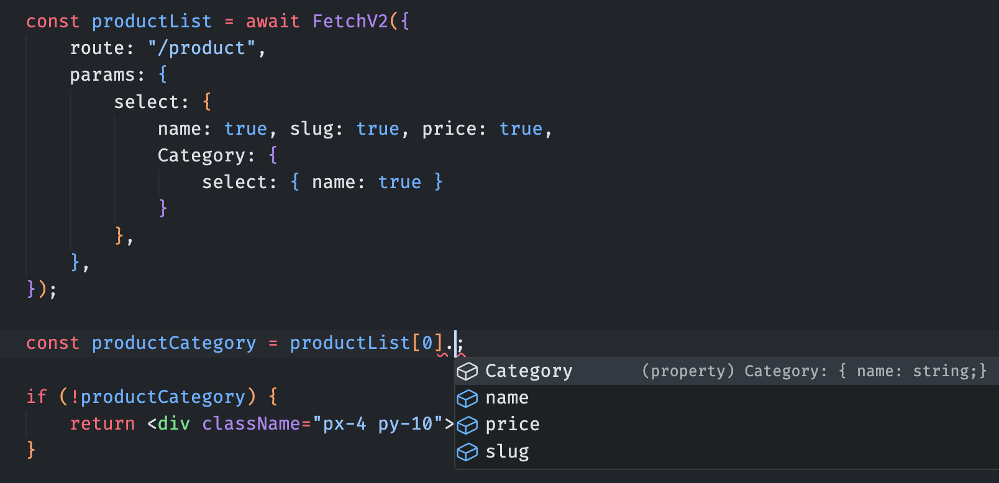

# CRUD Prisma

[Home](../README.md) > [CRUD Prisma](./crud-prisma.md)

This project uses a service generator based on the [Prisma Schema](../prisma/schema.prisma) designed to work with optimized utilities.

<h2>Table of contents</h2>

- [Features](#features)
- [Services](#services)
    - [Types](#types)
    - [Class](#class)
    - [API routes](#api-routes)
    - [Server Actions](#server-actions)
- [Data Fetching](#data-fetching)
    - [Fetch](#fetch)
    - [useFetch](#usefetch)
    - [FetchParallelized](#fetchparallelized)
    - [FetchConfig](#fetchconfig)
- [Data Mutation](#data-mutation)
    - [Function naming](#function-naming)
    - [Use cases](#use-cases)
        - [In a Server Component](#in-a-server-component)
        - [In a Client Component](#in-a-client-component)
        - [In a Process script](#in-a-process-script)
- [How it works](#how-it-works)
    - [Service generation](#service-generation)
    - [API route indexing system](#api-route-indexing-system)
    - [Dynamic Prisma response inference](#dynamic-prisma-response-inference)

## Features

1. Perfect auto-completion and strongly typed
    - Typed routes and params
    - Dynamically inferred Prisma response type
2. Automatic service generation with a single command
3. Fully customizable templates
4. Types and Server Actions available throughout the application
5. Optimized system:
    - **FETCH** with cache
    - Secure and sequential **MUTATIONS**

## Services

Service files are generated from customizable templates.

### Types

> [!NOTE]
> The `types` files export types throughout the application.

Each `types` file contains the `Props` arguments, [Zod](https://zod.dev/) validation schemas and `Response` return types.

The types files are generated from customizable templates:

- [Model Types template](../templates/services/types/{{model}}Type.hbs)
- [Index Types template](../templates/services/types/index.hbs)

### Class

> [!WARNING]
> The `class` files are not intended to be used directly. \
> They are wrapped by the `API routes` and `Server Actions` files.

Each `class` file contains a class dedicated to a Prisma model and all methods related to that model.

The `class` files are generated from customizable templates:

- [Model Class template](../templates/services/class/{{model}}Class.hbs)
- [Index Class template](../templates/services/class/index.hbs)

### API routes

> [!NOTE]
>
> **API routes** are dedicated to data **FETCH** with cache.

Each `API route` file wraps and exports the **FETCH** methods of a `class`.

The exported methods are: `findFirst`, `findUnique`, `findMany`, `count`.

The `API routes` files are generated from customizable templates:

- [Model API route template](../templates/services/api/{{model}}Api.hbs)
- [Index API route template](../templates/services/api/index.hbs)

### Server Actions

> [!NOTE]
>
> **Server Actions** are dedicated to mutations.

Each `Server Action` file wraps and exports the **MUTATIONS** methods of a `class`.

The exported methods are: `create`, `createMany`, `upsert`, `upsertMany`, `update`, `updateMany`, `delete`, `deleteMany`.

There are also **FETCH** methods without cache: `findFirst`, `findUnique`, `findMany`, `count`. These methods are very useful for checking data during a mutation process to ensure the data is fresh.

The `Server Actions` files are generated from customizable templates:

- [Model Server Action template](../templates/services/actions/{{model}}Action.hbs)
- [Index Server Action template](../templates/services/actions/index.hbs)

## Data Fetching

This system provides a set of tools to fetch data from server or client components. There are `Fetch`, `useFetch` and `FetchParallelized`.

### Fetch

The `FetchV2` function is an optimized version of the `fetch` function.

It will provide auto-completion for the `route` and `params` properties. And the `response` type will be dynamically inferred from the `Prisma.{Model}GetPayload` utility type.

Open your auto-complete and select a route.



Then, select Prisma filters in the params.



After that, use your strongly typed data.



> [!NOTE]
> See the [FetchV2](../utils/FetchV2/FetchV2.ts) function for more details. \
> Also, see the [usage example](../app/examples/Fetch/page.tsx) for a better understanding.
> You can [try it out online!](https://eco-service.nansp.dev/examples/Fetch)

### useFetch

The `useFetch` hook is a wrapper around the `FetchV2` function.

It will automatically fetch data from the server when a params change.

This hook provides a `data` value, `isLoading` state to handle loading state and `error` state to handle errors.

By default, the hook will not fetch data on the first render. This is useful for [Next.js SSR](https://nextjs.org/docs/app/building-your-application/routing/loading-ui-and-streaming#what-is-streaming) when hydrating initial values of a `useState` with server data.


> [!NOTE]
> See the [useFetch](../utils/FetchV2/FetchHookV2.ts) hook for more details. \
> Also, see the SSR usage example for a better understanding :
>
> 1. The [Page component](../app/examples/useFetch/page.tsx) uses `FetchV2` function to fetch server data, and gives it to the client component to hydrate initial values of the `useState`
> 2. The [Client component](../app/examples/useFetch/client.tsx) uses `useFetch` hook to refresh data when a button is clicked, and displays the `useState` data
> 3. The [Fetch params](../app/examples/useFetch/fetchParams.ts) is a helper function to generate fetch params
>    You can [try it out online!](https://eco-service.nansp.dev/examples/useFetch)

### FetchParallelized

> [!WARNING]
> This function is still in development.

The `FetchParallelizedV2` function is a wrapper around the `FetchV2` function.

It will provide types for parallelized requests.

> [!NOTE]
> See the [FetchParallelizedV2](../utils/FetchV2/FetchParallelizedV2.ts) function for more details. \
> Also, see the [usage example](../app/examples/FetchParallelized/page.tsx) for a better understanding.
> You can [try it out online!](https://eco-service.nansp.dev/examples/FetchParallelized)

### FetchConfig

The `FetchConfig` function is a configuration file that contains the some shared types and caching options.

> [!NOTE]
> See the [FetchConfig](../utils/FetchConfig.ts) file for more details.

## Data Mutation

This system generates a bunch of Server Actions for each model.

### Function naming

Each `Server Action` names are following the naming convention : `{model}{action}`.

- `{model}` is the name of the model in the [Schema Prisma](../prisma/schema.prisma).
- `{action}` is the name in of the action.

For the `model User { ... }` in the [Schema Prisma](../prisma/schema.prisma), the following Server Actions will be generated :

1. Mutation functions
    - `UserCreate`
    - `UserCreateMany`
    - `UserUpsert`
    - `UserUpsertMany`
    - `UserUpdate`
    - `UserUpdateMany`
    - `UserDelete`
    - `UserDeleteMany`

2. Fetch functions
    - `UserFindFirst`
    - `UserFindUnique`
    - `UserFindMany`
    - `UserCount`

### Use cases

The [Next.js Server Actions](https://nextjs.org/docs/app/building-your-application/data-fetching/server-actions-and-mutations) are the best way to mutate data in your application, because: they are secure, typed, sequential and callable from anywhere.

#### In a Server Component

> [!TIP]
> Not the best way to mutate data

Use a server action in a `Server Component` works like a regular function. But you can't use React hooks to improve the user experience with `loader` or `feedbacks` states.

> [!NOTE]
> See the [usage example](../app/examples/Actions/server/page.tsx) for a better understanding. \
> You can [try it out online!](https://eco-service.nansp.dev/examples/Actions/server)

#### In a Client Component

> [!TIP]
> Nice and efficient way to mutate data

Use a server action in a `Client Component` give you the ability to use React hooks to improve the user experience with `loader` or `feedbacks` states.

> [!NOTE]
> See the [usage example](../app/examples/Actions/client/page.tsx) for a better understanding. \
> You can [try it out online!](https://eco-service.nansp.dev/examples/Actions/client)

#### In a Process script

> [!TIP]
> The safest way to mutate data

Use a server action in a `Process script` is a powerful way to safely mutate data in your application. You can check authorization, validate data, check existing data and other business logic before mutating data.

> [!NOTE]
> See the [usage example](../app/examples/Actions/process/page.tsx) for a better understanding. \
> You can [try it out online!](https://eco-service.nansp.dev/examples/Actions/process)

## How it works

Here is a simplified explanation of how the service generation, API route indexing and dynamic Prisma response inference systems work.

### Service generation

Service generation is done in several steps:

- Call the `pnpm run generate:all` command which executes the [generator.ts](../scripts/generator.ts) script that calls command files in the [/scripts/generator/](../scripts/generator/) folder
- First, the `generate:all` command extracts the list of models present in the [Prisma Schema](../prisma/schema.prisma) with a regex
- Then, the `services/` and `app/api/internal/` directories are cleaned and deleted to avoid conflicts with the newly generated files
- Finally, service files are generated in `services/` from `templates/` into which model names are injected
- To finish, index files to list API routes and the Next.js API handler are generated in `app/api/internal/`

### API route indexing system

API route indexing allows for a system of typed and optimized API routes for caching and data **FETCH**. Here's how it works:

- Each file in the `services/api/` folder contains and exports API functions for a Prisma model
- The `services/api/index.ts` file centralizes and exports all API functions for all Prisma models
- The `app/api/internal/[...routes]/route.ts` file intercepts all API requests and redirects them to the corresponding API functions

### Dynamic Prisma response inference

Dynamic Prisma response inference allows for dynamically generating Prisma response typing based on request filters and parameters.

Here's an example:

```tsx
// Prisma request
const user = await FetchV2({
    route: "/user/findFirst",
    params: {
        select: {
            name: true,
            email: true,
            Product: {
                select: {
                    name: true,
                    price: true,
                },
            },
        },
    },
});

// Prisma response type
type UserResponse = {
    name: string;
    email: string;
    Product: {
        name: string;
        price: number;
    }[];
};
```

- During service generation, `types` files are generated in `services/types/` for each Prisma model
- These files contain the `Prisma.{Model}GetPayload` utility which allows inferring the Prisma response type based on request filters and parameters
- Prisma types are propagated through `services/class` files, then `services/api` and `app/api/internal/Routes.ts`
- The `FetchV2` utility uses routes and types indexed in the `app/api/internal/Routes.ts` file to infer Prisma response types.
